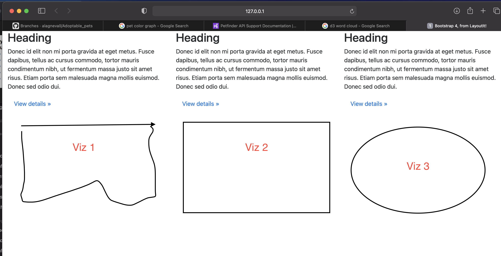

# Adoptable Pets

Project Description
  Our project will look at adopatable pets in Kansas using data from an API from Petfinder.com.  
  
Data sets
    Petfinder.com API:  https://www.petfinder.com/developers/v2/docs/
    Zip Code/County Data:
    
Planned Viz's
    Heatmap of total adoptable pets by zip code/county
    Layered map (by species) with adoptable pet info plotted
    One More TBD

Sketch of Design

GitHub Link

